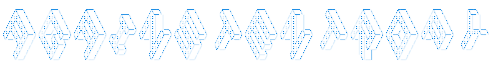

# Hi there 👋

✨ This is [_Yihao (Ethan) Wang_](https://againstentropy.github.io)

- 🌱 Master's student at NYU, obtained a bachelor's degree in Physics from FDU
- 🔭 Exploring on-device AI deployment and inference acceleration
- 🏸 Passionated about badminton, cycling, hiking, ...
- 📫 Feel free to contact me!

  
  

Projects I have contributed to: (click to expand)

 
<!-- make use of description_lines_count -->

  
  

  
  

  
  

  
  

  
  

  
  

